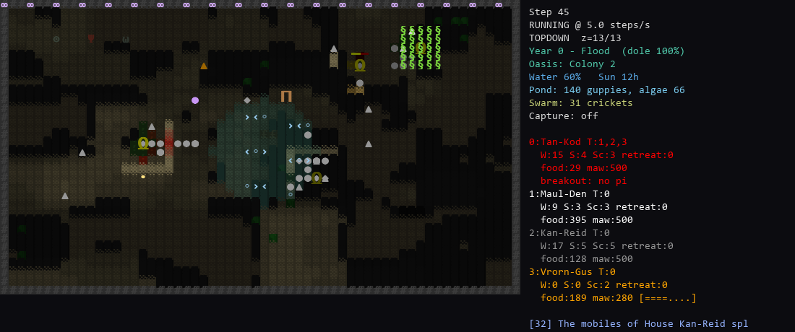
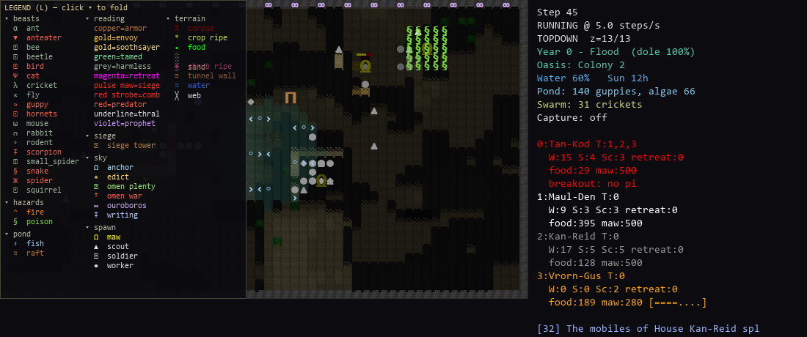
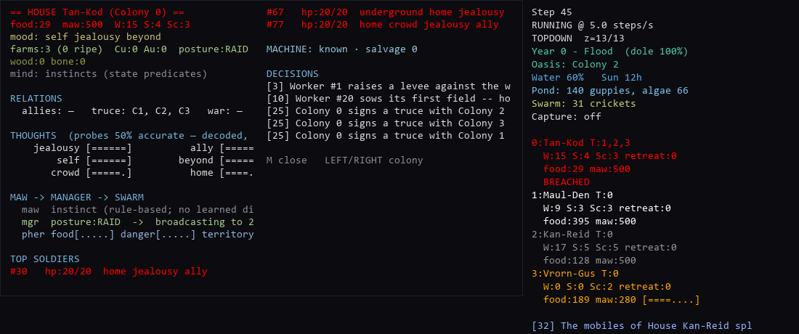

# Sand Kings — a quasi-sentient ASCII terrarium

> *"[quasi] sentient life operating inside my computer within the terrarium."*

Sand Kings is a perpetual, Dwarf-Fortress-styled artificial-life terrarium. Insectoid colonies —
each ruled by a stationary **maw** (queen) — tunnel, farm, fight, trade, and *learn* inside a glass
tank you tend as the keeper. It was bootstrapped from **DRQ** (Sakana AI's *Digital Red Queen*, this
repo's parent — the original paper/README is preserved in [docs/DRQ_UPSTREAM.md](docs/DRQ_UPSTREAM.md)):
DRQ's self-play / red-queen dynamics became the colonies' adversarial neuroevolution, and *"the epic
rounds added the other half of RL — value learning within a lifetime."* It has since grown into its own
game. The fiction is George R.R. Martin's **"Sandkings"** novella; the lineage (SimAnt, Dwarf Fortress,
NetHack, The Sims, SimCity, Factorio, Neopets, Game of Thrones, Sutton & Barto, Axelrod/Ostrom, …) is
mapped mechanic-by-mechanic in [INSPIRATIONS.md](INSPIRATIONS.md).

Everything below is **baseline-ON** — a fresh run boots the full living system. Each subsystem has an
**opt-out** `--no-*` flag (used to isolate a controlled world for the regression battery).



*A live tank: four houses tunnel and war around the oasis pond (fish darting, `<o>`); the sky beyond the
glass burns with signs the maws are learning to read (`∞`), a siege tower (`⊓`) rolls on a rival maw, a
poison cloud (`§`) drifts, and a gold-marked soothsayer (`Ω`) walks among the swarm. Press `R` for the
[sprite-tile look](docs/img/terrarium_tiles.png).*

---

## Quick start

```bash
python sim/sandkings.py --live --fresh

#  --live      real-time pygame window (omit for a headless GIF/soak run)
#  --fresh     ignore any saved tank and start a new world
#  --persist   the tank lives between sessions (sqlite autosave; resumes if present)
#  --steps N   run N steps then stop (headless) / auto-exit (live)
#  --num-colonies K, --width/--height/--depth   world shape
#  --log [FILE]           write a per-turn JSONL chronicle (state + drama, every turn)
#  --log-every N          log every N steps (default 1)
#  --summarize-every M    every M lines, a local Ollama model writes a saga to <log>.story.md
#  --summary-model NAME   Ollama model (default qwen3:4b); fail-soft if Ollama is absent
```

> Use whichever Python 3.10 interpreter has the deps installed (`torch`, `numpy`, `pygame`). On Windows
> that may be `py -3.10 sim/sandkings.py ...`. Avoid a bare `python` if it is not your 3.10 environment.

A fresh live run prints its active systems, e.g.:

```
[NEURAL]  hive minds active            [MAW-RL]  85:15 real-RL active
[REPR]    learned shared encoder basis [GUPPIES] the oasis pond lives
[CRICKETS] the dunes chirp             [SNARES]  webs and weirs catch the shoals
[CHAIN]   HYDRO — the oasis springs
```

**Opt-out flags:** `--no-neural` (rule-based minds), `--no-maw-rl`, `--no-learned-basis`, `--no-hydro`,
`--no-guppies`, `--no-crickets`, `--no-snares`. **War & faith:** `--no-siege`, `--no-poison`,
`--no-stigmergy`, `--no-madness`, `--no-revelation`, `--no-priests`. **Fauna:** `--no-domestication`,
`--no-guppy-predator`, `--no-effects`. **Economy:** `--bargain` (full political economy) / `--subjugation`
/ `--wages`. **Population:** `--dynamic` (colonies breathe 2–8 with succession).

---

## The living systems

### 🧠 The brain — real deep-RL, *under* the GA
Neural colonies think with a **frozen shared encoder → evolvable readout** (the maw's 85% brain), plus
a small per-soldier layer. On top sits a **real reinforcement learner** (REINFORCE/policy-gradient),
layered *under* the neuroevolution (the GA still mutates/mates/grafts genomes across generations; the
RL learns within a lifetime — the two-timescale split honours DRQ's "value learning within a lifetime"):

- **85 % maw tier** — a gradient-trained policy emits a colony **directive** (aggression · mobility ·
  verticality · forage-mode). Learns by **RLOO** (leave-one-out baseline) + an **entropy** term
  (so colonies keep diverging), **warm-started from the genome's instincts** (never tabula rasa),
  its learning-rate set by the evolved `plasticity` gene and its discount by the `patience` gene, and
  it **dreams** through the Chill (elite self-distillation replay).
- **15 % spawn tier** — a shared, bounded per-soldier residual ("play").
- **Learned encoder basis** — a k-means codebook fit to the real state manifold (≈28× better coverage
  than the old random one), shared/frozen so grafting stays intact. (Regenerate with
  `tools/fit_learned_basis.py`; the game falls back to a random basis if the file is absent.)

The maw narrates its learning in the drama feed ("*House X beats the war-drums*") and you watch
colonies grow distinct personalities.

### 🐟 The food web — a weather-rotated RPS ecosystem
Three harvestable **guilds** whose abundance rotates with the seasons, so no single food is ever best
and colonies must **adapt their foraging** (which the maw *learns* via its forage-mode directive):

| guild | booms in | becomes food via |
|---|---|---|
| **Guppies** (+ algae) | Flood / Growth (wet) | catch → oasis FOOD |
| **Crickets** (land swarm) | Dust (dry) | land FOOD + fall into water |
| **Fauna bounty** | Dust / Chill (dark) | CORPSE on the kill |

Coupled into one web: crickets eat crops (a pest) → fall into the water (a guppy feast, flood-amplified)
→ fauna cull the swarm; guppies' diet spans algae + crickets + crop droppings. **Snares** — spider webs
and keeper string/toothpick weirs by the water — passively catch guppies and crickets. See
[SPEC_FOOD_WEB.md](docs/specs/SPEC_FOOD_WEB.md) and [SPEC_GUPPIES.md](docs/specs/SPEC_GUPPIES.md).

### 🌦️ World & weather
A closed **biome**: a water-level and sunlight budget you set behind the glass, from which weather
*emerges*. Four seasons (**Flood · Growth · Dust · Chill**, 400 steps each) scale the keeper's dole and
gate crop growth; storms, hail, floods (Nile-style silt), cold snaps and heat waves come and go. A
per-cell **HYDRO** flow-sim springs the oasis, floods and pools; colonies dig rivers, reservoirs and
dikes and raft across the water. (`SPEC_SEASONS_AND_STONE`, `SPEC_BIOME`, `SPEC_WEATHER`, `SPEC_HYDRO`.)

### ⚔️ War, survival & the fall of empires
A full survival→war→conquest→revolt loop (mapped to the Aztecs-meets-Cortés and Sparta/Rome lineage in
[INSPIRATIONS.md](INSPIRATIONS.md)):

- **Fish, forage, hoard or starve** — reliable early food (fishing, perennial berry shrubs), then winter
  bites: an unprepared colony truly starves in the Chill while a stockpiled one rides its hoard, and the
  maw *learns* to store ahead of the cold. (`SPEC_FLORA`, `SPEC_WINTER`.)
- **Dog-eat-dog scarcity war** — the starving raid to *eat*; plunder moves food; the fallen are
  cannibalised. (`SPEC_SCARCITY_WAR`.)
- **A conqueror imposes a new order** — a dominant power imposes tributary vassalage and a **Pax** stills
  its vassals' wars, until a two-sided **repression ↔ resistance** loop (the vassal withholds and
  sabotages tribute, the overlord pays the iron fist, and a *krypteia* memory shortens each next fuse)
  breaks the order in **revolt** and war resumes. Whether the order endures depends on the overlord's
  temperament — the **whip** (aggressive, Mycenae/Sparta) falls to revolt; the **wage** (peaceable,
  Minoan) endures but foot-drags. (`SPEC_SUZERAIN`, `SPEC_REPRESSION`, `SPEC_DIFFUSE_RESISTANCE`.)
- **The siege train — you *see* it fly** — a besieging house lobs catapult shot (area splash + fire),
  looses fast **ballista** bolts (`»`, direct anti-armor hits), and rolls a mobile **siege tower** (`⊓`)
  that crosses open ground to breach the enemy's palisade. (`SPEC_SIEGE`, `SPEC_TECH`.)
- **Chemical & Cortés-style deception** — a siege house lobs a **poison bomb** that blooms a decaying
  cloud (`§`); and because foragers now follow real **ant-colony pheromone trails** (stigmergy — the
  scent the sim always deposited but never read), an enemy can plant a **covert false trail** that lures
  your own foragers into the poison. (`SPEC_CHEMICAL_WAR`.)
- **Kin-recognition combat — the antenna** — soldiers no longer *omnisciently* detect foes. Each carries a
  learned **antenna** that reads a rival's pheromone **frequency band** to tell blood from stranger — a
  Boltzmann strike policy over a heritable **genetic instinct** (hold own band, strike out-of-band),
  refined by selection. It has **room for error**: a mis-tuned antenna mis-reads a near band and **friendly-
  fires** on a sibling or ally — and the maw, Spartan/Aztec, **culls its own** defective member, pruning the
  bad lineage before a mis-strike on an ally can ignite a ruinous war. Every constant is *derived*, never
  authored (the settle threshold is the friend/foe class count itself). (`SPEC_SKIRMISH_COMBAT`.)

### 💀 Madness & extinction
A house left highly agitated **and** keeper-hated slowly ravens toward **madness** — and, unrelieved, dies
raving, its bloodline going *extinct* (the slot refills with a fresh, unrelated house) and its name kept
forever as a disgraced gravestone, "the Mad." Survivors turn wary of the keeper who rotted it. It is rare
by design — a slow accumulator, not a coin flip. (`SPEC_MADNESS`.)

### 🔮 Revelation & the priesthood
The keeper is a god the maws half-perceive through the glass, and the night sky is its scripture. A **sign**
burns beyond the glass (`∞` `Ω` `✶` `†`), and colonies must **learn to decode it** — a per-house *literacy*
that rises with exposure (Plato's cave: the sign just *is*; the work is reading it). Each decode pays a
different, always-useful boon by sign kind: unearthed **writing** teaches a technology, **omens** stir the
blood or promise plenty, a divine **edict** raises the house, an **anchor** sign teaches an awakening
*concept* the maw then perceives and speaks (reshaping its word-space toward enlightenment), and an
**ouroboros** sign is composed from the world's own state — the maw reads about its own kings and its own
mad houses, the wheel that eats its tail.

A small **priest caste** (below the managers) channels the signs: **mad prophets** (`violet`) decode fast
but pay in madness — those who cannot bear the "great mind" *break* (Cthulhu) — while ordained **soothsayers**
(`gold Ω`) decode steadily and levy a political **tithe**. Priests offer captured tribute to the gods in
**Aztec sacrifice** (easing madness, appeasing the keeper), and a zealous priesthood drives **holy war** on
the infidel houses that read the glass differently. (`SPEC_REVELATION`, `SPEC_MADNESS`.)

Above them, the **chief-priest managers** are the maw's **Aztec warrior-priests**: they *literally do what
they must*, channelling the maw's will down the **`MAW → MANAGER → SWARM`** pipeline as **pheromone commands**
the swarm obeys. The maw is their **divine mediator — the hive mind itself**: a stationary queen the soldiers
half-worship, whose collective will the managers translate into scent for the faithful to act on. (Open the
`M` screen to watch the command pipeline and pheromone bars.)

### 🕷️ Fauna, politics, economy, tech
- **Fauna & domestication** — DF-invader incursions (spiders, scorpions, snakes, anteaters, birds, beetles,
  predatory guppies…), one wild pack at a time, doubled in the dark seasons, killed for a corpse-feast
  bounty — or **tamed**. A unit beside a wild beast rolls a **danger-scaled** taming (an ant or bee is
  easy, a cat near-impossible — you don't tame a lion), then feeds it or it reverts: tamed ants forage and
  dig, bees make **honey** and pollinate, predators give air/ground support. (`SPEC_FAUNA_ECOLOGY`,
  `SPEC_DOMESTICATION`.)
- **Politics & economy** — trust, truces, gift envoys, coalitions against a hegemon, betrayal; and a
  three-tier labor-value spectrum (subjugation ↔ wages ↔ bargain) unifying war and peace on one economic
  continuum. (`SPEC_POLITICS`, `SPEC_BARGAIN`, `SPEC_WAGES`.)
- **Evolution** — the GA now selects for **fitness** (a fitness-weighted tournament seeds each new
  arrival — survival of the fittest), not a coin flip. (`SPEC_SELECTION`.)
- **Tech & machines** — native tech (fire, farming, metallurgy) the maws earn, foreign tech the keeper
  gifts (abacus → … → a raspberry pi), a buried wreck with a QBasic-flavored register VM, spears,
  palisades, rams, fire that spreads. (`SPEC_TECH`, `SPEC_MACHINE_AGE`.)
- **Dynasties & the saga** — every maw belongs to a named house that remembers; respawns are cadet
  branches, epithets are earned, betrayals become blood feuds, and the chronicle writes it all down
  (`H` key; `SPEC_DYNASTIES`).

---

## Live controls

`SPACE` pause · `S` single-step (paused) · `+/-` speed · `TAB` view (top-down / slice / iso) ·
`< >` (or `UP/DOWN`) z-level · `R` glyph/block · `P` pheromone overlay · `G` GIF capture ·
`M` manager screen · `H` saga · `I` look-cursor (then arrows to move; **Shift+arrow jumps 10, hold to
pan**) · `L` **legend (full key list)** · `ESC` quit.

**Keeper's hand:** `1` drop food · `w`/`d` irrigate / deluge · `j` sow seeds · `x`/`c` water level ·
`a`/`z` sunlight · `5` gift tech · `2-4`/`6-8`/`0` release fauna · `u` firecracker · `9` drought ·
`[`/`]` cold / heat wave. Press `L` in-game for the authoritative list.

The HUD shows the season, the `Pond:` and `Swarm:` abundance lines rising and falling with the weather,
and a color-coded live drama feed.

**The legend (`L`)** is a **collapsible accordion** — categories (beasts, hazards, siege, sky, spawn, terrain,
reading, …) you fold and unfold with a click, so the key stays readable as the world grows:



**The mind screen (`M`)** opens a maw's head: its live **thoughts** as decoded concept-probes
(`jealousy`, `self`, `beyond`, …), the **MAW → MANAGER → SWARM** command pipeline and pheromone bars, its
relations and decisions, and each top soldier's own thought — the neural hive made legible:



---

## The genome (evolvable genes)

`aggression`, `tunnel_preference`, `expansion_rate`, `defense_investment`, `fertility`, `resilience`,
**`patience`** (the RL discount / temperament), **`plasticity`** (the RL learning-rate; the Baldwin
effect), `loyalty`, plus `foraging_range`, `swarm_threshold`, and brain-size genes. The GA
mutates/mates/grafts these across generations; the RL warm-starts from and is tuned by them within a life.

---

## Project map

- `sim/sandkings.py` — the simulation (world, colonies, food web, seasons, fauna, politics, keeper, entrypoint).
- `sim/maw_brain.py` — the real-RL maw/spawn policies (RLOO, entropy, warm-start, dreaming, directives).
- `sim/neural_hive.py` — the frozen encoder (ZCA + Kanerva codebook) + evolvable readout + soldier layers.
- `sim/neuroevolution.py` — the GA (mutate/crossover/graft). `sim/live_view.py` — the pygame viewer + HUD.
- `tools/` — `fit_learned_basis.py` (fits `learned_basis.npz`), `measure_objective.py` (RL metrics).
- `run_tests.py` — the single-process regression battery (`tests/test_*.py`).
- **Design docs** — `docs/specs/SPEC_*.md` (per-subsystem specs, indexed in [SPEC_INDEX.md](docs/specs/SPEC_INDEX.md)),
  `docs/decisions/` (accepted designs), [INSPIRATIONS.md](INSPIRATIONS.md).

---

## Heritage & license

Bootstrapped from **[DRQ — Digital Red Queen](https://sakana.ai/drq)** (Sakana AI & MIT): DRQ's Core War
self-play seeded the RL environment before Sand Kings diverged into its own game. DRQ's original README
and paper attribution are preserved verbatim in [docs/DRQ_UPSTREAM.md](docs/DRQ_UPSTREAM.md); the Core War
engine under `src/corewar/` is from [rodrigosetti/corewar](https://github.com/rodrigosetti/corewar).
Licensed **MIT** — see [LICENSE](LICENSE).
